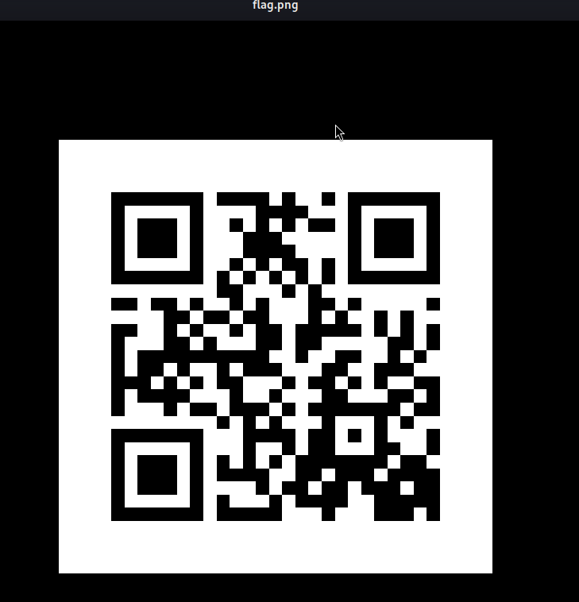
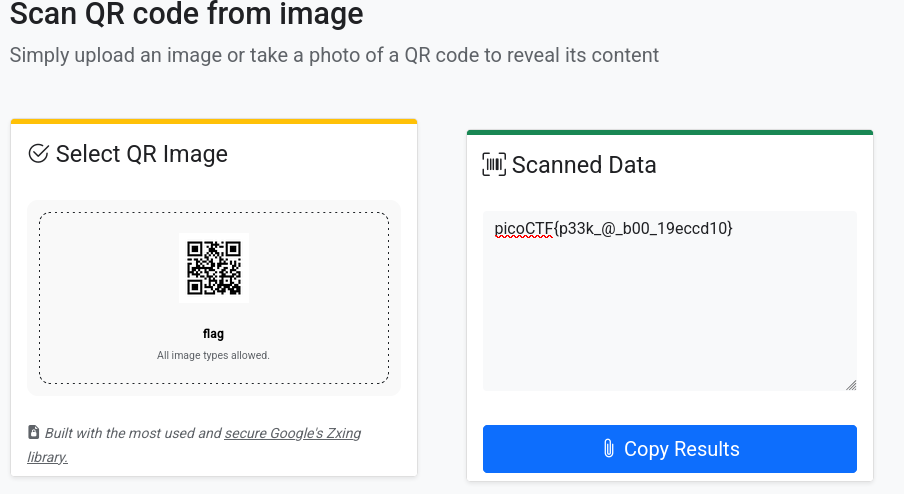

**Description:** I've gotten bored of handing out flags as text. Wouldn't it be cool if they were an image instead? You can download the challenge files here:

**challenge.zip**

**Topic:** Forensic

First we need to download the `zip` file from the problem first 

```bash
wget https://artifacts.picoctf.net/c_atlas/15/challenge.zip
```
Unzip the file:

```bash 
unzip challenge.zip
```
And we have the `flag.png`

Open that image up with 

```bash
eog flag.png
```
And we have an `QR` scan 



Scan it with `scanqr.org` in website and we have 



And we have the flag: 

**Flag:** `picoCTF{p33k_@_b00_19eccd10}`
