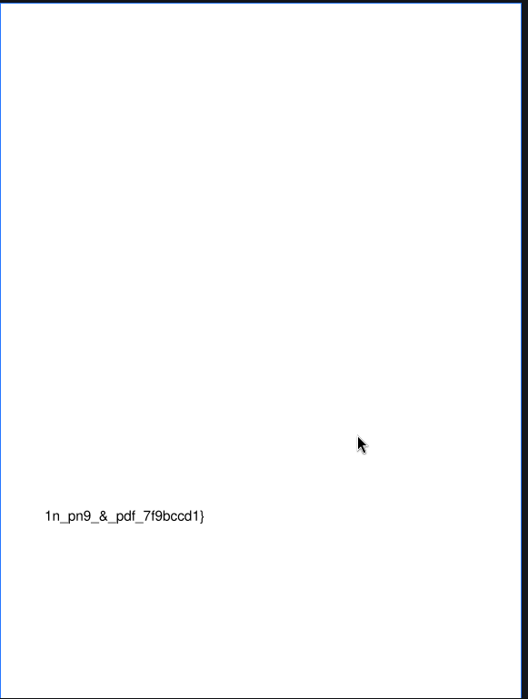
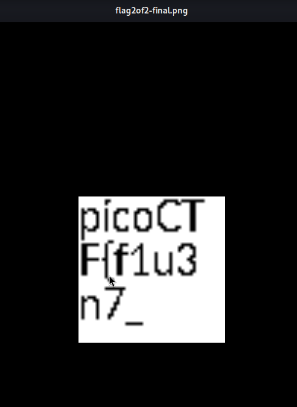

**Description:** This file contains more than it seems. Get the flag from garden.jpg.

**Topic:** Forensic

First we need to download the image from the problem first 

```bash
wget https://artifacts.picoctf.net/c_titan/9/flag2of2-final.pdf
```
The title emphasise the main keyword here :) -> **CONFLICTING INFORMATION ON WHAT TYPE OF FILE IT IS" 

So first and formost, i check the type of file eventhough it have `pdf` suffix :)

```bash 
atril flag2of2-final.pdf
```
And we have the first part of the flag, but it seem to missing the `header` part to make it a flag.



But somehow my still run some of the basic forensics tool to check if there are any breadcrumbs left just to make sure -> and it still don't have anything. Though of `image` type of file, i converted it into `.png`type of file to see if any thing happen 

```bash 
convert flag2of2-final.pdf flag2of2-final.png
```

And the have the first part of the flag 
 

Ran this one: 

```bash 
echo $(cat flag.txt | grep  "first" | cut -d ":" -f2 | cut -d  ' ' -f2)$(cat flag.txt | grep "second" | cut -d ":" -f2)
```

And we have the flag: 

**Flag:** `picoCTF{f1u3n7_1n_pn9_&_pdf_7f9bccd1}
`
