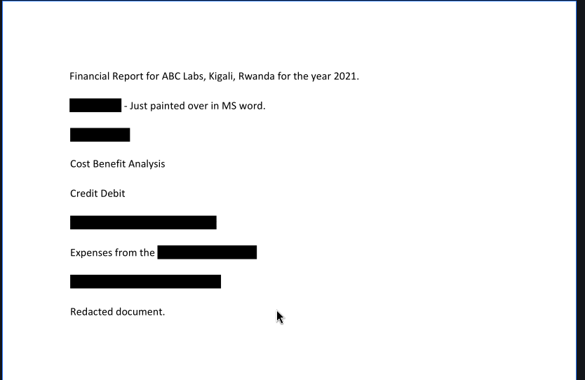
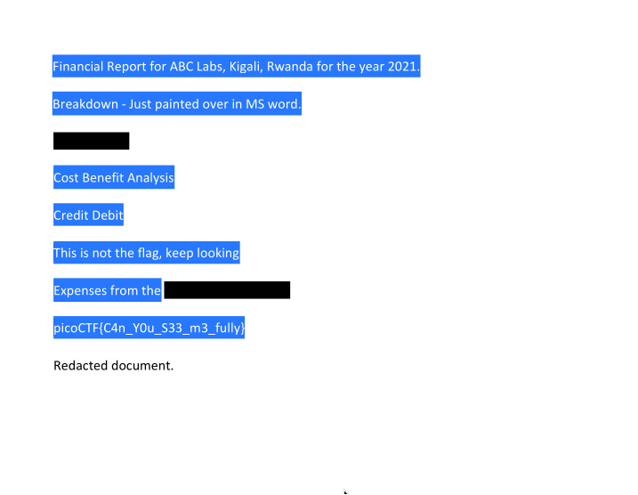

**Description:** Now you DON’T see me. This report has some critical data in it, some of which have been redacted correctly, while some were not. Can you find an important key that was not redacted properly?

**Topic:** Forensic

First we need to download the pdf file from the problem first 

```bash
wget https://artifacts.picoctf.net/c/84/Financial_Report_for_ABC_Labs.pdf
```
Open the pdf file with `atril` 

```bash 
atril Financial_Report_for_ABC_Labs.pdf
```
We can easily see that it being paint black the backbground of some of the keywords 



Highlight all of the black background we saw:

 

Extract it into text and grep it out 

```bash 
pdftotext Financial_Report_for_ABC_Labs.pdf 

cat Financial_Report_for_ABC_Labs.txt | grep -oE "picoCTF{.*?}"
```

And we have the flag: 

**Flag:** `picoCTF{C4n_Y0u_S33_m3_fully}`
