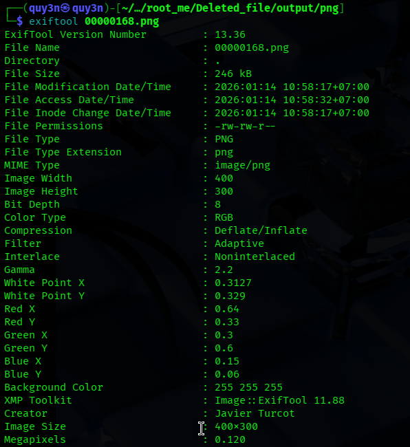

**Description**: Your cousin found a USB stick at the library this morning. He’s not very good with computers, so he’s counting on you to find the owner of this key!

Flag is the identity of the owner in the form `firstname_lastname`

First, download the file from problem first 

```bash 
wget https://static.root-me.org/forensic/ch39/ch39.gz

# verify with the sha256sum hash from the author too:cd9f4ada5e2a97ec6def65554765247127e3d8ee99c26ec2f11682a1194778
```
```bash 
# extract the `gz` file 
gunzip ch39.gz
```
We have `ch39` tar file after unzip it 

```bash 
tar -xf ch39
```
And we have an `usb.image` file 

Could use `foremost` or `binwalk` to recover the headers, binary embedded file within the original file,... 

``` bash 
foremost usb.image
```
We have a `output` folder contain the information after extract from the `image`  

```bash 
exiftool <image_name>.png
```
And we have the author name 



**Flag:** `javier_turcot`
